<p align="center">
  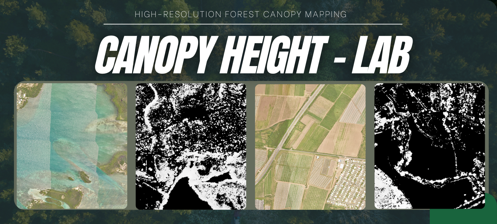
</p>


### Proyecto final – Modelos Transformer aplicados a Imágenes

> Implementación inspirada en el artículo  
> **“High-resolution canopy height maps by learning from airborne lidar and spaceborne GEDI”**  
> Repositorio original: https://github.com/facebookresearch/HighResCanopyHeight

---

## 📌 Contexto y objetivo del proyecto

El monitoreo forestal es indispensable para la gestión de recursos naturales y la comprensión del cambio climático.  
Para hacerlo bien, no basta con un mapa binario “bosque / no bosque”: se necesita un **censo estructural del bosque**, es decir, saber:

- cuánta área tiene árboles,
- qué tan altos son esos árboles,
- y cómo se distribuye la altura del dosel en el territorio.

Hoy existen herramientas de teledetección potentes, como el **LiDAR (láser)** y las cámaras ópticas de alta resolución, que permiten reconstruir bastante bien la estructura forestal.  
Sin embargo, las soluciones de alcance global presentan limitaciones importantes. En particular:

- El **LiDAR satelital GEDI** (NASA) ofrece cobertura casi global,  
  pero con **baja resolución (~25 m)** y datos **discretos** en forma de huellas,  
  no como un mapa continuo.
- El **LiDAR aéreo (ALS)** sí permite mapas muy detallados,  
  pero solo existe para campañas puntuales y regiones concretas.

Esto genera un **vacío de datos continuos de muy alta resolución (VHR)** sobre la altura del dosel: justo el tipo de información que se necesitaría como base para un censo forestal estructural detallado.

A partir de este contexto, la pregunta problema que abordamos es:

> **¿Cómo generar, a partir de imágenes satelitales RGB de alta resolución, mapas continuos y precisos de altura del dosel que sirvan de base a un censo forestal estructural de detalle?**

Para cerrar este vacío, tomamos como referencia el artículo:

> *“High-resolution canopy height maps by learning from airborne lidar and spaceborne GEDI”* (Meta / FAIR)

Este trabajo propone convertir imágenes ópticas de muy alta resolución en **mapas continuos de altura por píxel (~1 m)**, combinando:

- **LiDAR aéreo (ALS)** → detalle fino y estructura local del dosel.  
- **LiDAR satelital GEDI** → contexto global y calibración de alturas.

En este repositorio:

- Reproducimos y adaptamos el modelo basado en *Vision Transformers* y *Dense Prediction Transformer (DPT)*.  
- Utilizamos los modelos preentrenados publicados por los autores (SSL + ALS + GEDI).  
- Construimos una interfaz en **Streamlit** que permite:
  - explorar ejemplos reales del dataset NEON,  
  - cargar pares propios (RGB + CHM) para evaluación,  
  - y visualizar de forma interactiva mapas de altura del dosel que pueden usarse como base para un censo estructural (altura promedio, distribución de alturas, etc.).


---


## 🏗️ Resumen teórico de la arquitectura

Aquí se resume la arquitectura completa en 3 niveles: **encoder SSL**, **decoder ALS** y **modelo GEDI + fusión**.

---

### 1. Encoder SSL: ViT Huge con DINOv2

<p align="center">
  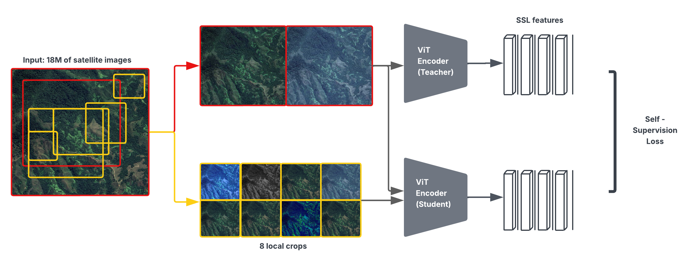
</p>


1. **Entrada**
   - Imágenes satelitales globales de 256×256 píxeles.
   - Se genera un **multi-crop**:
     - 2 vistas **globales**.
     - 8 vistas **locales** (algunas con máscara).

2. **Tokenización**
   - Cada imagen se divide en parches 16×16 → se aplanan a vectores.
   - Se proyectan a un embedding de dimensión 1280 y se les suma un embedding posicional.

3. **Teacher–Student (DINOv2)**
   - Dos ViT con la misma arquitectura:

<p align="center">
  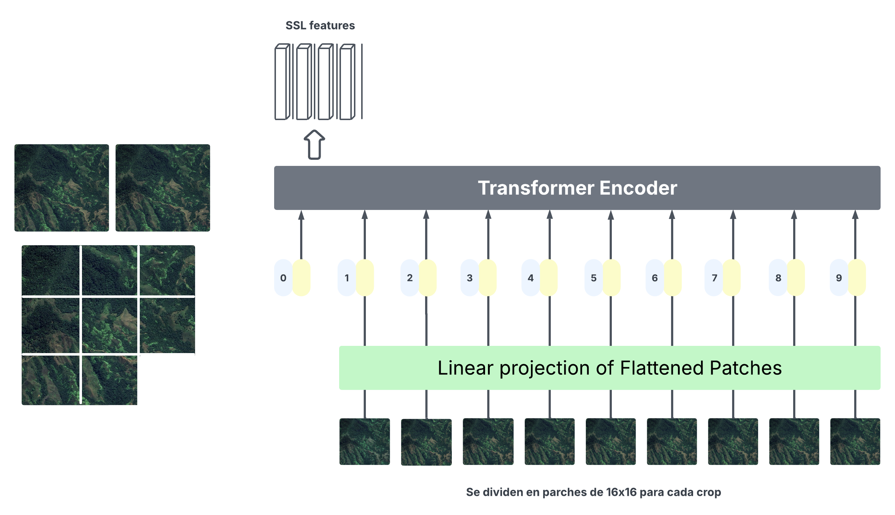
</p>


  - **Student**: recibe vistas globales + locales (con masking). Se actualiza por gradiente.
  - **Teacher**: recibe vistas globales, se actualiza por EMA (promedio móvil de los pesos del student).
  - Las salidas del student intentan **imitar las del teacher** → pérdida de auto-supervisión.
  - Al final de esta fase nos quedamos con el **encoder entrenado**, no con un mapa de salida.

---

### 2. Decoder DPT para CHM de alta resolución (ALS)

<p align="center">
  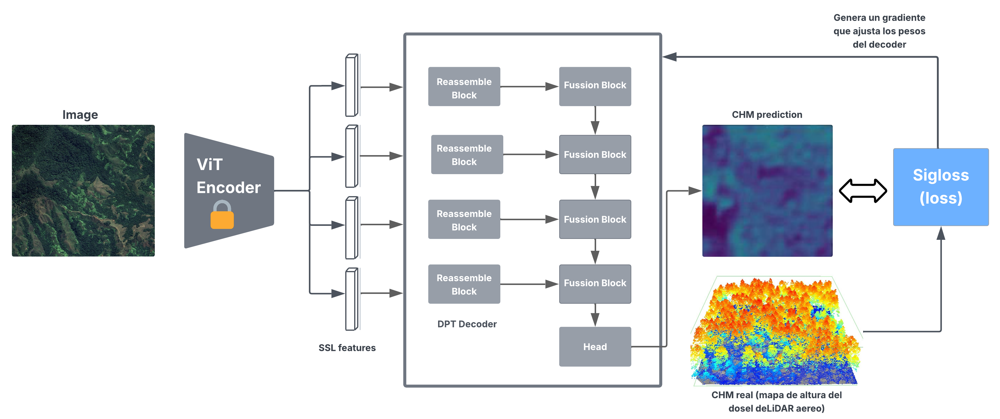
</p>

A partir de aquí, el encoder queda **congelado** y sólo se entrena el decoder.

1. **Reassemble blocks**

   - Toman las features del ViT en distintas capas y las transforman en mapas 2D a distintas escalas.

   <p align="center">
  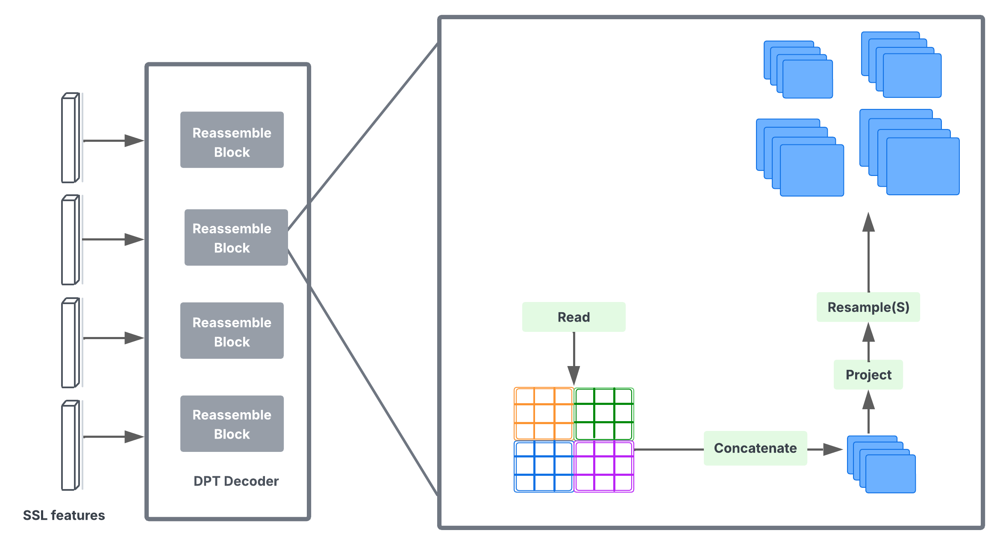
</p>

   - Cada bloque:
     - **Read**: reordena los tokens a su posición espacial → mapa 2D.
     - **Concat + Project (Conv 1×1)**: apila canales y reduce/reorganiza la información.
     - **Resampleₛ**: ajusta el tamaño del mapa para trabajar en escalas 1/32, 1/16, 1/8 y 1/4.

2. **Fusion blocks**


   - Combinan información **global** (mapas más pequeños) con **detalle fino** (mapas de mayor resolución).

<p align="center">
  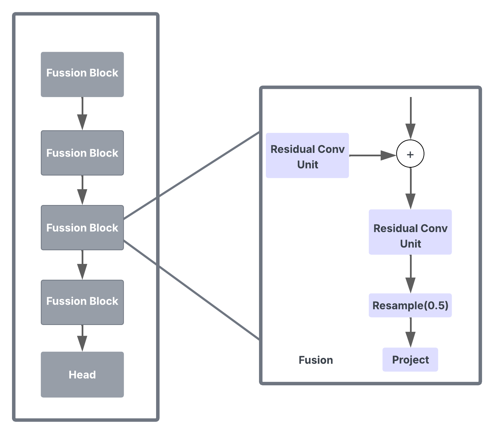
</p>

   - Cada bloque:
     - Aplica una **Residual Conv Unit** para limpiar/refinar.
     - **Suma residual** entre el mapa global y el mapa más fino.
     - Hace un **upsample ×2** (Resample₀.5) para ir subiendo de resolución.
     - Otro **Project (Conv 1×1)** adapta el número de canales para el siguiente nivel.

3. **Head (salida por bins)**

<p align="center">
  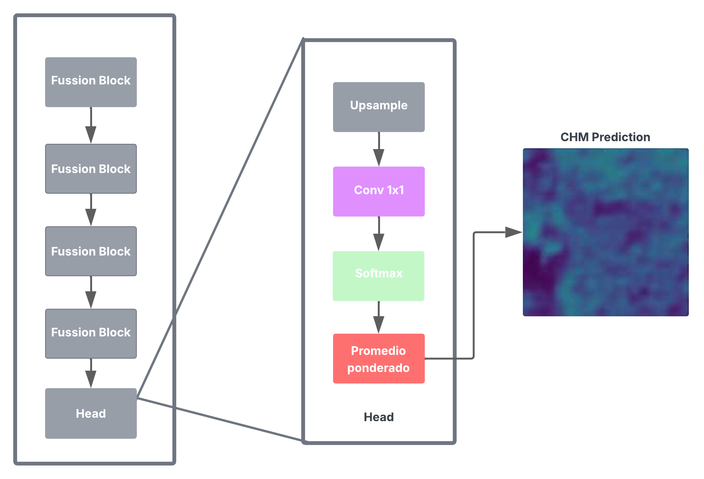
</p>

   - Toma el último mapa de features (64×64) y:
     - Aplica un **upsample** para volver a 256×256.
     - Conv 1×1 → genera **256 bins de altura por píxel**.
     - Softmax → histograma de probabilidad de altura por píxel.
     - Promedio ponderado → altura esperada en metros.
   - Se obtiene un **CHM predicho 256×256**, alineado con el tile de entrada.

4. **Función de pérdida: Sigloss**


   - Variante de la pérdida de profundidad de Eigen et al.:
     - Trabaja en espacio logarítmico.
     - Penaliza errores absolutos y errores globales de escala.
   - Se usa el **CHM ALS real** como verdad terreno.

---

### 3. Modelo GEDI global y fusión ALS + GEDI

<p align="center">
  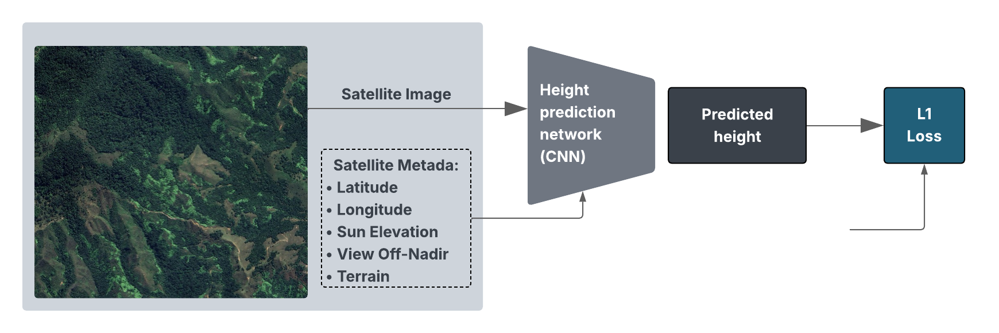
</p>

1. **Modelo GEDI (CNN + metadata)**

   - Entrada:
     - Parche RGB de 128×128.
     - Metadatos: latitud, longitud, elevación solar, ángulo off-nadir, pendiente del terreno.
   - Arquitectura:
     - **Extractor CNN** con varias capas Conv2D + ReLU + MaxPooling.
     - **Flatten → capas densas**, donde se concatenan los metadatos.
   - Salida:
     - Un escalar: altura **RH95** (GEDI) en ese footprint.

<p align="center">
  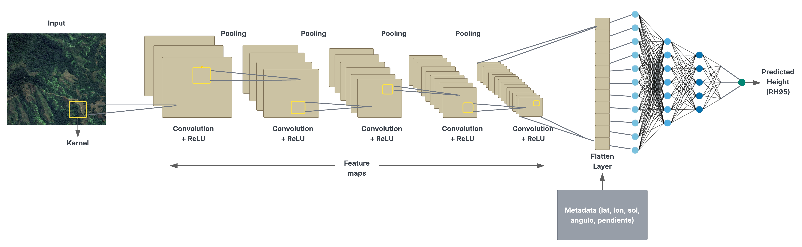
</p>

   - Pérdida:
   
     - **L1 Loss** entre altura predicha y altura medida por GEDI.

2. **Cálculo de factor de reescalamiento**

   - Se cruzan las predicciones del modelo ALS y del modelo GEDI en zonas con datos comunes.
   - Se calcula un **factor de escala espacialmente suave** que corrige el CHM ALS.

<p align="center">
  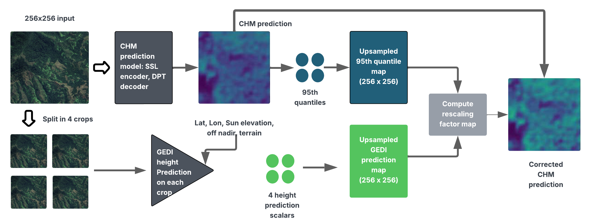
</p>

3. **CHM final**
   - El CHM ALS de alta resolución se multiplica por el factor de reescalamiento.
   - Resultado: **canopy height map continuo**, detallado y coherente con GEDI a escala global.

---


## 📁 Estructura del repositorio

La organización del proyecto está pensada para separar claramente la **lógica del modelo**, la **app de Streamlit**, los **pesos preentrenados** y la **configuración de despliegue con Docker**.

```bash
.
├── app/
│   ├── streamlit_landing_CHM_app.py  (Archivo principal de entrada de la app (landing / menú de navegación).)
│   └── pages/
│       ├── 1_Metodología.py (Página donde se explica la metodología del modelo, fases, arquitectura y flujo de datos.)
│       └── Demostración.py  (Página central de la demo interactiva.)
│
├── model/   (Contiene la lógica de alto nivel para el modelo y la inferencia:)
│   ├── ssl_model.py
│   ├── inference_neon_tile.py
│   ├── inference_uploaded_pair.py
│   ├── neon_data.py
│   └── metrics.py
│
├── models/   (implementaciones de bajo nivel reutilizadas del repositorio original del paper)
│   ├── backbone.py
│   ├── dpt_head.py
│   ├── regressor.py
│   └── pl_modules/
│       └── ... (módulos auxiliares de PyTorch Lightning)
│
├── saved_checkpoints/ (Guarda los pesos preentrenados del modelo CHM)
│   └── compressed_SSLhuge_aerial.pth
│
├── data/  (Contiene los recursos necesarios para reconstruir el NeonDataset) 
│   └── neon/
│       ├── neon_tiles.csv
│       └── ... (rutas / referencias a los tiles NEON)
│
│
├── Dockerfile
├── requirements.txt
└── README.md
```

---

## ⚖️🌳 Descarga de pesos preentrenados 

Para que la aplicación pueda realizar **inferencia real**, es indispensable descargar los **pesos preentrenados** del modelo original de Meta AI:  
**High-Resolution Canopy Height Maps**.


#### ¿De dónde descargar los pesos?

Para mantenernos alineados con el repositorio original de Meta, los datos y modelos preentrenados se descargan desde un bucket público de Amazon S3:

`S3: s3://dataforgood-fb-data/forests/v1/models/`

Desde la raíz del repositorio (la carpeta donde está este `README.md`), ejecuta en la terminal:

```bash
aws s3 --no-sign-request cp --recursive s3://dataforgood-fb-data/forests/v1/models/ .
unzip data.zip
rm data.zip
```

> ; Esto hará tres cosas:

1. Descargar todo el contenido del bucket (datos + checkpoints) a tu máquina.
2. Descomprimir data.zip (que contiene, entre otros, las imágenes aéreas de NEON).
3. Eliminar el .zip para no ocupar espacio extra.

💡 **Requisito:** debes tener instalado el AWS CLI (`aws`) y ejecutarlo desde la raíz del proyecto.

---

#### ¿Qué archivos son importantes para este proyecto?

Después de correr los comandos anteriores, en la carpeta `saved_checkpoints/` tendrás varios modelos.  
Para esta app de Streamlit, los más relevantes son:

- `compressed_SSLhuge_aerial.pth`

  Encoder entrenado en imágenes satelitales y decoder entrenado en imágenes aéreas.

  Es el checkpoint que usamos para inferencia en la aplicación (modo NEON / modo imagen subida).

- **Pesos de la red de normalización RNet**

  Se utilizan cuando normtype = 2.

  El nombre del archivo debe coincidir con el que espera la función  
  `load_rnet_normalizer()` en `model/ssl_model.py`.

  Importante: no renombres los archivos, para que el código lo encuentre sin problemas.

---

#### ¿Dónde ubicar los archivos descargados?

Todos los checkpoints deben quedar en la carpeta:

`saved_checkpoints/`

Si usaste los comandos de nombrados, esta carpeta se crea automáticamente y los archivos ya quedarán en la ubicación correcta, por lo que no es necesario moverlos a mano.


---

## 🚀 Ejecución del Proyecto con **Docker**
Instalación • Despliegue • Uso

Este proyecto está preparado para ejecutarse fácilmente usando **Docker**, sin necesidad de instalar manualmente todas las dependencias en tu máquina local.


#### 📁 Clonar el repositorio

```bash
git clone https://github.com/StevenVegaL/HighRes-Canopy-Height
cd HighResCanopyHeightApp
```

⚠️ Importante:
Antes de continuar, asegúrate de que la carpeta saved_checkpoints/ contiene los pesos indicados en la sección anterior (modelo CHM y RNet).


#### 🛠️ Construir la imagen Docker
Desde la raíz del proyecto, ejecuta:

```bash

docker build -t chm-demo .

```


🔎 ¿Qué hace este comando?

Elemento	Descripción
-t chm-demo	Asigna el nombre chm-demo a la imagen Docker
.	Usa el Dockerfile ubicado en el directorio actual


####  ▶️ Ejecutar el contenedor
Una vez construida la imagen, puedes levantar el contenedor con:

```bash
docker run -p 8501:8501 chm-demo
```


💡 Si el puerto 8501 ya está ocupado en tu máquina, puedes usar otro puerto externo, por ejemplo:

```bash
docker run -p 8502:8501 chm-demo
```


#### 🌐 Acceder a la aplicación
Con el contenedor en ejecución, abre tu navegador en:

```bash
http://localhost:8501
```
Deberías ver la landing de la aplicación.


---

## 💻 Ejecución local (opcional, sin Docker)

Aunque la forma recomendada de ejecutar el proyecto es mediante **Docker**, también puedes correr la aplicación **localmente** si ya tienes **Python** instalado en tu máquina.


#### 🧬 Crear entorno virtual e instalar dependencias

Se recomienda usar un entorno virtual para aislar las dependencias del proyecto.

#### 1️⃣ Crear y activar el entorno virtual

```bash
python -m venv .venv
```

En Windows:

```bash
.venv\Scripts\activate
```

En Linux / macOS:

```bash

source .venv/bin/activate
```

Verás que el prompt de tu terminal cambia, indicando que el entorno .venv está activo.

2️⃣ Actualizar pip e instalar dependencias
Con el entorno virtual activado, ejecuta:

```bash
pip install --upgrade pip
pip install -r requirements.txt

```


#### 🚀  Lanzar la aplicación con Streamlit
Una vez instaladas las dependencias, desde la raíz del proyecto ejecuta:

```bash

streamlit run app/streamlit_landing_CHM_app.py

```

Si todo está correctamente configurado (incluyendo los pesos en saved_checkpoints/), Streamlit levantará la aplicación.

🌐 Acceder a la app
Abre tu navegador y visita:

```bash
http://localhost:8501
```

Allí ceberías ver la landing de la aplicación.

<p align="center">
  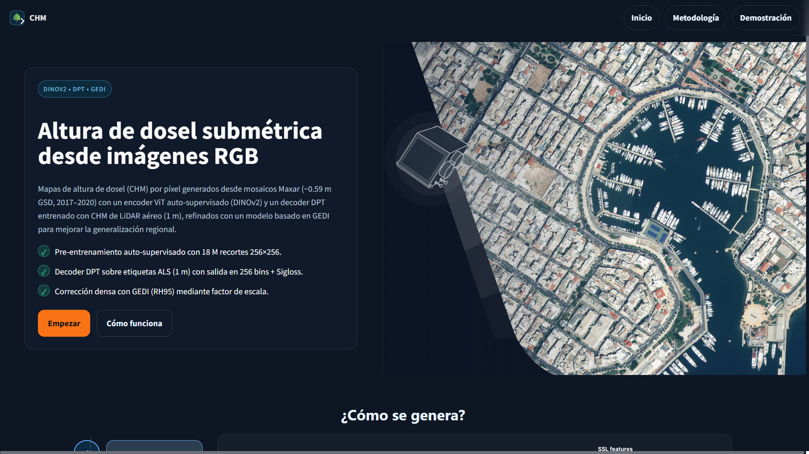
</p>

---


## 🧠 ¿cómo se realiza la inferencia?

La lógica de carga de pesos y de inferencia está dividida en dos contextos:

- #### 🌲 Modo NEON (dataset) – usa **RNet + NeonDataset**  
- #### 🖼️ Modo de imagen subida – usa solo el **modelo CHM con normalización global**

En la aplicación de Streamlit implementé estos **dos modos de uso**:

---

### 🌲 Modo NEON (dataset)


En este modo trabajo con **ejemplos internos del dataset NEON**, que es el mismo conjunto de datos que usa el artículo original.  


<p align="center">
  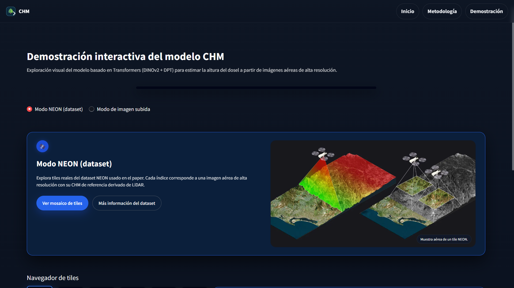
</p>


Aquí **no** permito que el usuario suba cualquier imagen, sino que utilizo los **tiles definidos en el CSV** del repositorio oficial.

El flujo es:

1. A través de un **navegador de tiles** (índice NEON), selecciono un recorte del dataset.


2. Con ese índice, cargo:
   - La **imagen aérea RGB**.
   - El **CHM real** asociado (derivado de LiDAR).

<p align="center">
  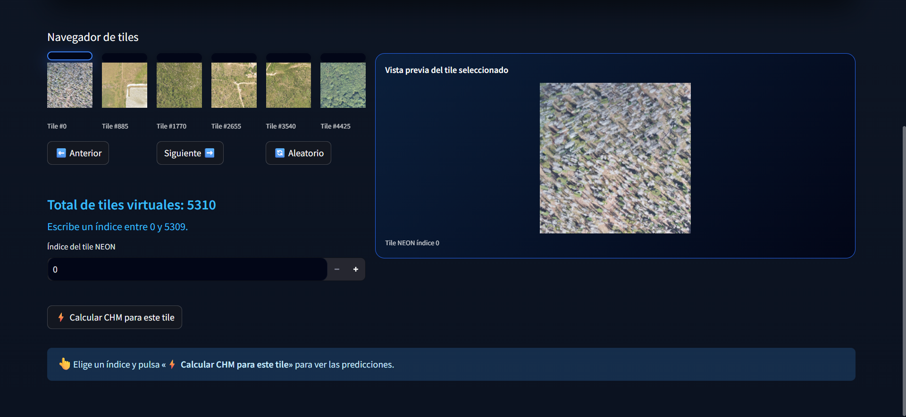
</p>


3. Para la carga de datos reutilizo la misma lógica del paper:
   - Uso la clase `NeonDataset`.
   - Aplico la red de normalización de dominio **RNet** para que las imágenes queden en el mismo espacio del entrenamiento.
4. Sobre la imagen normalizada paso el **modelo Transformer preentrenado (DINOv2 + DPT)** y obtengo el **mapa de altura predicho (CHM)**.
5. Como también tengo el CHM real, en la interfaz puedo mostrar:
   - La **imagen aérea RGB**.
   - El **CHM predicho**.
   - El **CHM de referencia** (LiDAR).

6. Con ambos mapas (predicho vs real) calculo métricas como:
   - **MAE**
   - **RMSE**
   - **R² (pixel y por bloques)**
   - **Bias (sesgo medio)**

   <p align="center">
  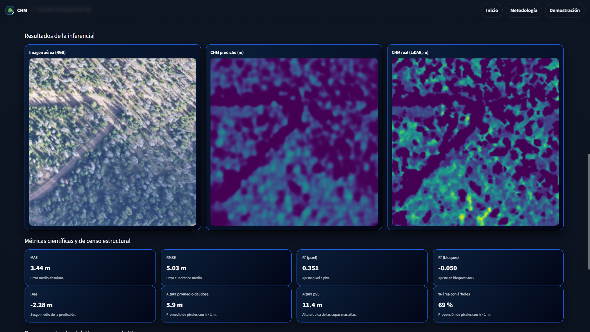
</p>

De esta forma, el modo NEON reproduce de forma muy fiel el **pipeline original de evaluación** que se describe en el paper.

---

### 🖼️ Modo de imagen subida

<p align="center">
  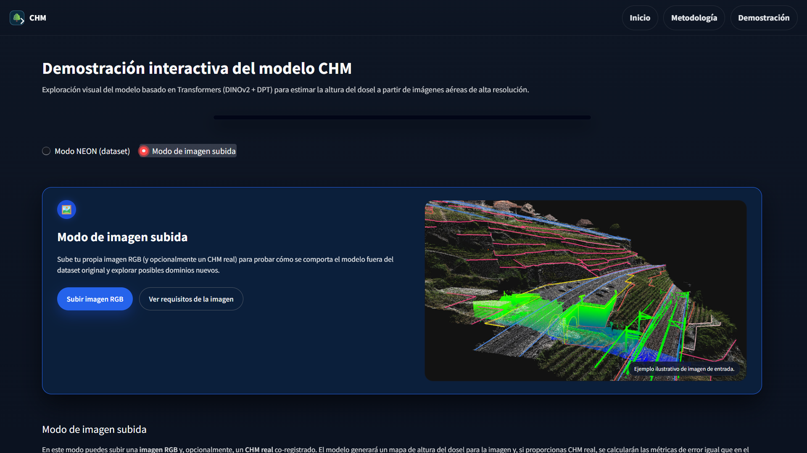
</p>

El segundo modo es más flexible: la aplicación permite que el usuario suba un par de archivos:

- Una **imagen RGB** (vista aérea).
- Opcionalmente, el **CHM real** correspondiente a esa misma zona.


La idea es que estos archivos tengan características similares a las de NEON (vista aérea, buena resolución, recortes tipo 256×256, etc.).

El flujo es:

1. El usuario sube la imagen RGB (y opcionalmente el CHM real).

<p align="center">
  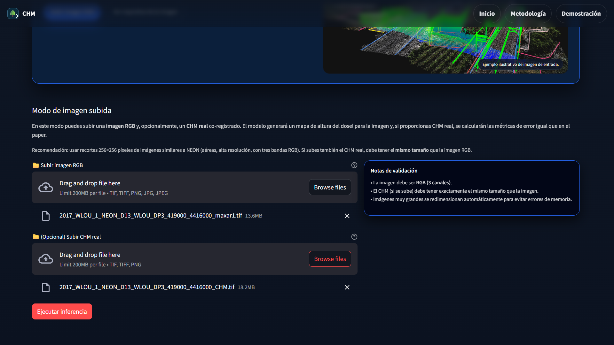
</p>

2. La app verifica que:
   - La imagen sea **RGB (3 canales)**.
   - Si se sube CHM real, sus **dimensiones coincidan exactamente** con la predicción que produce el modelo.
3. La imagen RGB pasa por el mismo **preprocesamiento**:
   - Conversión a `float32` y normalización a `[0, 1]`.
   - Aplicación de la **normalización global por canal** (los mismos `mean`/`std` del script original).
4. Esa imagen normalizada se pasa al **modelo CHM preentrenado**, que genera el mapa de altura predicho.
5. Si el usuario también subió un CHM real con el mismo tamaño, la app:
   - Compara **predicción vs CHM real**.
   - Calcula nuevamente las **métricas de error** (MAE, RMSE, R², Bias, etc.).
6. Todos los resultados se muestran de forma interactiva en Streamlit, con:
   - Imágenes en formato RGB/colormap.
   - Métricas en tablas y tarjetas tipo “dashboard”.

<p align="center">
  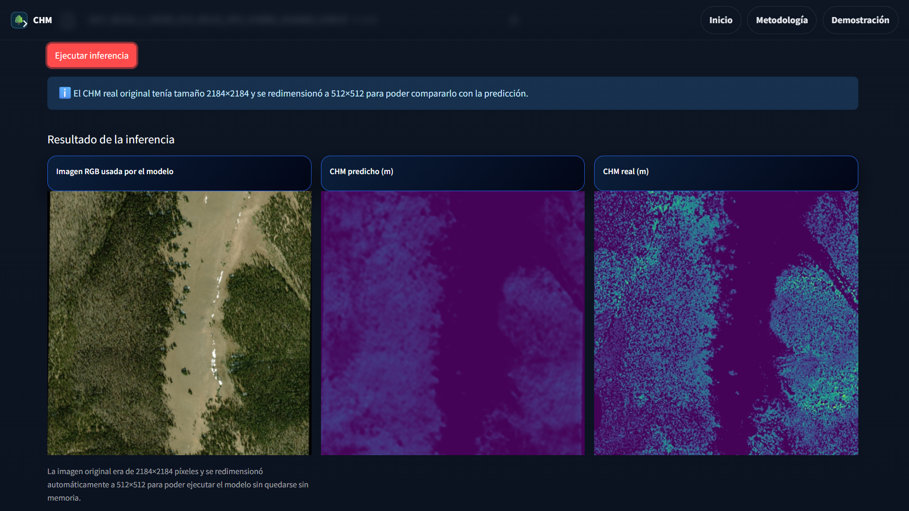
</p>

---

Con estos dos modos logramos un equilibrio entre:

- Un **modo muy fiel al paper**, usando directamente el dataset NEON, su pipeline y sus métricas originales.
- Un **modo de experimentación**, donde se pueden evaluar pares de datos externos que respeten condiciones similares (imagen RGB + CHM real), pero todo presentado de forma más **visual e interactiva** en Streamlit.


---

## 📚 Referencias

- Weinstein, B. G., et al. **High-resolution canopy height maps by learning from airborne lidar and spaceborne GEDI.**  
- Repositorio oficial: https://github.com/facebookresearch/HighResCanopyHeight

